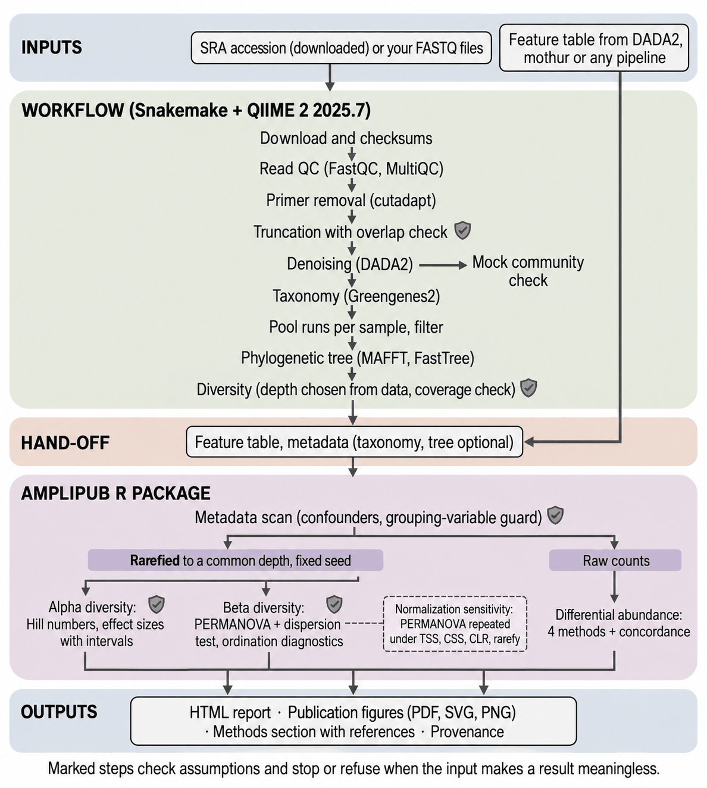
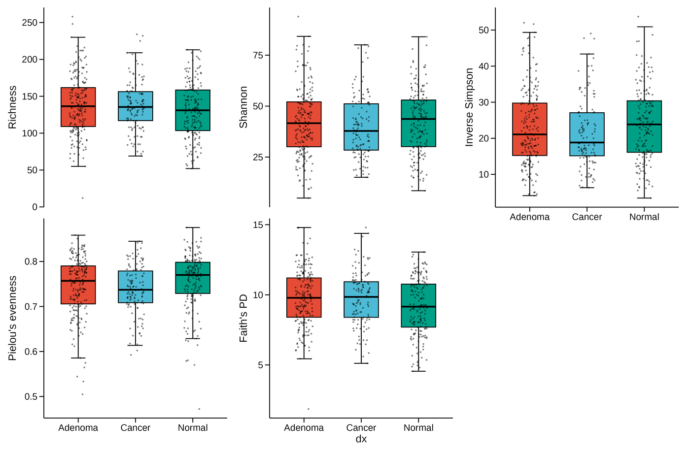
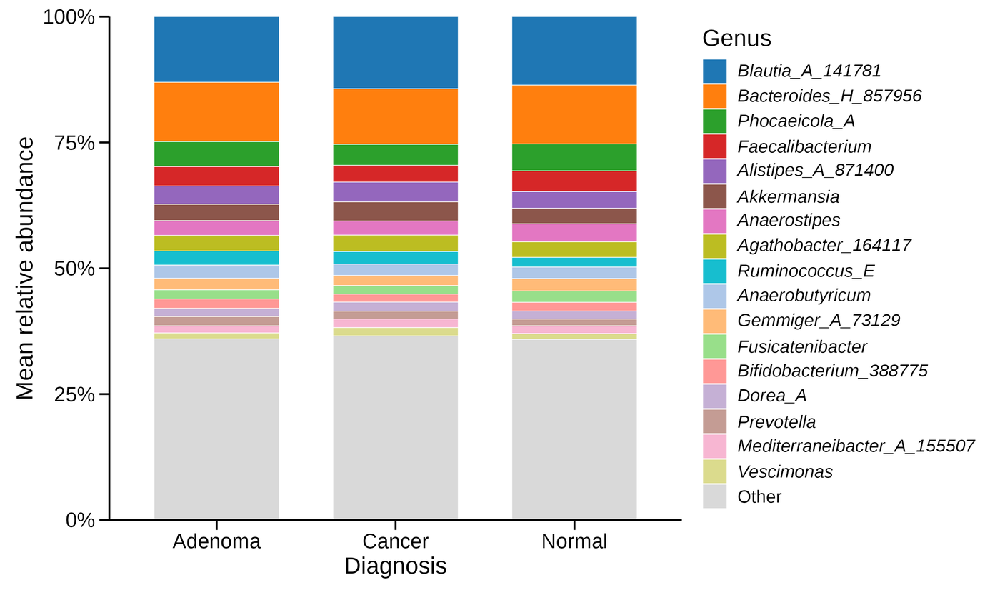
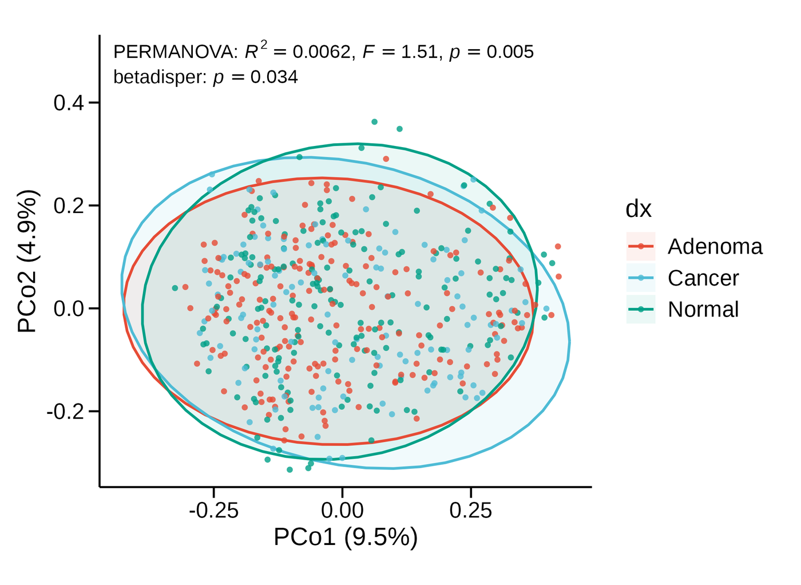
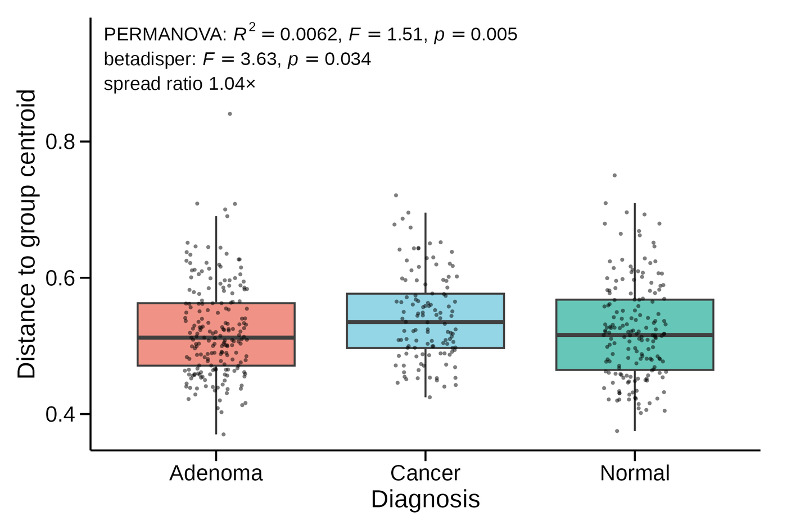
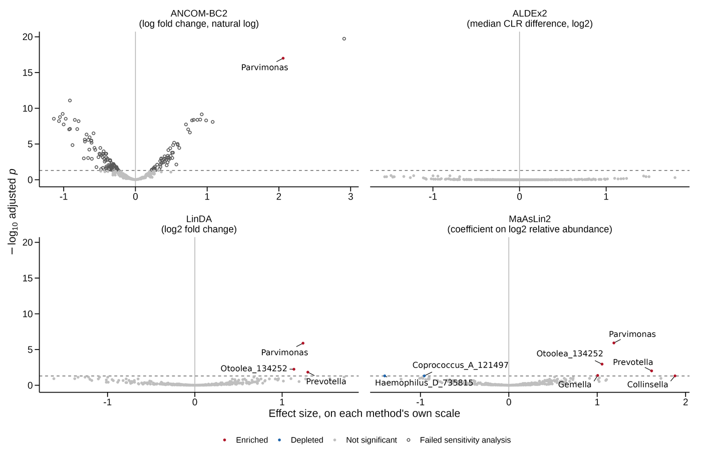
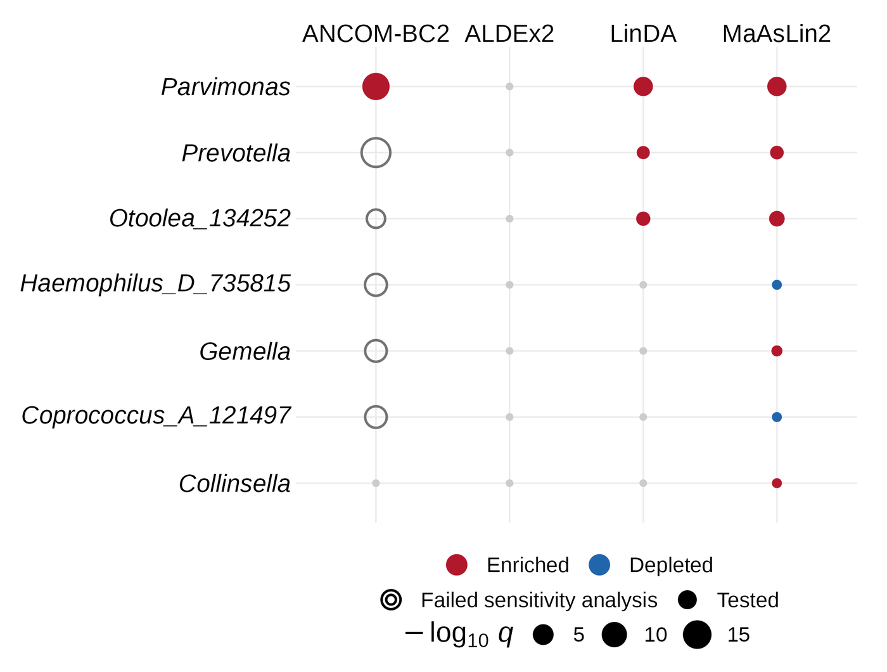

# AmpliPub 0.0.1

[](https://github.com/drbmanna/AmpliPub/actions/workflows/R-CMD-check.yaml)
[](https://github.com/drbmanna/AmpliPub/actions/workflows/workflow-tests.yaml)

From raw amplicon reads to publication-grade statistics and figures, in one reproducible
framework.

**Status: 0.0.1, first public release.** The sequence-processing pipeline and the R
statistics layer are both built and have been run end to end on a public 544-run dataset.
It has been validated on one 16S V4 dataset only, and the interface may still change. What
has and has not been checked is in [VALIDATION.md](VALIDATION.md).

**Scope.** The R statistics layer works on any amplicon feature table (16S rRNA, 18S, ITS or
a functional marker gene). The raw-read workflow has so far been run and validated only on
16S rRNA V4 data with a Greengenes2 V4 classifier; other markers need their own primers,
truncation settings and classifier.

## Motivation

Amplicon statistics are easy to run and easy to misread. A PERMANOVA p-value is read as a
shift in community composition when the groups may only differ in spread. Differential
abundance methods disagree with each other, and a paper usually reports one. An ordination
plot is read as a map when most of the variation lies off the plotted axes.

None of these mistakes produces an error. The software returns a number, and the number
looks fine. On the Baxter et al. 2016 data, PERMANOVA on diagnosis is significant
(p = 0.005), but the groups also differ in dispersion. ANCOM-BC2 flags 146 ASVs, of which
145 fail its own sensitivity analysis. No ASV is called by all four common methods.

AmpliPub runs the analysis from raw reads or a feature table, and at each step checks
whether the result means what it appears to mean. It says so in plain text when it does
not.

## More than a wrapper

Most amplicon tools compute the statistics and leave the reading of them to you. AmpliPub
computes them, checks the assumptions each result depends on, and says in plain text what
the result does and does not support. When the input makes a statistic meaningless, it
refuses rather than printing a number.

- **PERMANOVA never runs alone.** Every PERMANOVA is paired with a permutation test of
  dispersion (`betadisper` with `permutest`), and the output states whether the groups
  differ in location, in spread, or both. A significant PERMANOVA with unequal dispersion
  is a common misreading, and this pairing is what catches it.
- **Effect sizes come first.** Alpha diversity tests report Hedges' g, Cliff's delta or eta
  squared with a bootstrap interval next to every p-value. The test is chosen by checking
  normality and equal variance, not by habit, and repeated measures go to a mixed model.
- **Four differential abundance methods, one verdict table.** ALDEx2, ANCOM-BC2, LinDA and
  MaAsLin2 come from different statistical families and are known to disagree. AmpliPub
  runs all four on the same prevalence filter, aligns the sign of every effect to one
  reference level, and reports which features the methods agree on.
- **Does your conclusion survive normalization?** The PERMANOVA is repeated under TSS, CSS,
  CLR and rarefying, and the report says whether the result and its interpretation hold
  under all four.
- **Can this ordination be read as a map?** Each PCoA reports its negative eigenvalue mass
  and the variance on the plotted axes, and says when the picture should not be read as
  distances. On the development dataset, none of the four ordinations passed.
- **The metadata is checked before any test.** Variables that track the grouping variable
  are flagged as candidate confounders, and a grouping variable that is constant or unique
  to each sample is refused.
- **Refusals instead of silent numbers.** Chao1 and ACE on denoised tables, Good's coverage
  on a table without singletons, and Aitchison distance on a table that is mostly zeros are
  refused or flagged, with the reason.
- **The write-up comes from what ran.** A reader's guide explains each result. A methods
  section is generated with the versions that ran, the parameters used and references
  taken from each package's own citation file.
- **Checked against known answers.** Diversity values agree with QIIME 2 to within 1e-6
  on 487 samples, unweighted UniFrac is pinned to scikit-bio reference values,
  and planted-truth tests fix the direction of every differential abundance call. See
  [VALIDATION.md](VALIDATION.md), which also lists what has not been checked.

Some features are standard and are not claimed as new here. Pairwise PERMANOVA is also
offered by nf-core/ampliseq and MicrobiomeAnalyst, and nf-core/ampliseq also runs in
version-pinned environments.

Built and run today:

- Downloads reads from a single accession and checks that every file arrived intact.
- Demultiplexes, with every read accounted for and the barcode orientation checked.
- Runs read QC and QIIME 2 processing, and stops when a step fails silently.
- Measures what your amplicon region can and cannot tell apart, before you sequence.
- Logs every step, with the command, the versions and the thresholds used.
- Runs the statistics with the checks each test needs, such as a dispersion test with
  every PERMANOVA.
- Draws figures sized for journal columns, and writes a methods draft from the analysis
  that ran.

## Framework structure



| Stage | What runs | Status |
|---|---|---|
| Demultiplexing | `workflow/00_demux.py`: EMP-protocol demultiplexing with full read accounting and a barcode-orientation guard | Built, tested |
| Download | `workflow/00_fetch_sra.py`: one accession in, verified FASTQ, sample metadata, and a QIIME 2 manifest out | Built, tested |
| Environments | `workflow/setup_envs.sh`: QIIME 2 amplicon 2025.7, QC, Snakemake and R environments, each built from a committed lockfile | Built |
| Read QC | `workflow/00_qc_raw.py`: FastQC and MultiQC, before and after primer removal | Built, tested |
| Primer removal | `workflow/01_primers.py`: QIIME 2 (cutadapt), anchored primers, reads counted in and out | Built, tested |
| Quality and truncation | `workflow/02_quality.py`: QIIME 2 quality profiles, with an overlap check before reads are merged | Built, tested |
| Denoising | `workflow/03_dada2.py`: QIIME 2 (DADA2), with read retention checked per library against pre-registered criteria | Built, tested |
| Mock community check | `workflow/04_mock.py`: recovered sequences compared with a community of known composition, reported against published figures | Built, tested |
| Taxonomy | `workflow/05_taxonomy.py`: QIIME 2 classifiers, with a disagreement rate between two references reported per rank | Built, tested |
| Region resolution | `workflow/06_resolution.py`: what a chosen amplicon region can and cannot tell apart, measured from the reference before sequencing | Built, tested |
| Pool runs per sample | `workflow/07_collapse.py`: the runs of each sample pooled, with the read total proved unchanged | Built, tested |
| Filtering | `workflow/08_filter.py`: taxonomy, sample and prevalence filters, with the cost of each reported | Built, tested |
| Tree | `workflow/09_tree.py`: MAFFT, masking, FastTree and rooting, with the tips proved to cover the table | Built, tested |
| Diversity | `workflow/10_diversity.py`: alpha and beta diversity with the rarefaction depth chosen from the data, and Good's coverage checked for degeneracy | Built, tested |
| Statistics and figures | AmpliPub R package, run by `workflow/scripts/run_amplipub.R`, with an HTML report | Built, tested |
| Whole run | `workflow/Snakefile`: every stage above in one invocation, with provenance recorded | Built, tested |

QIIME 2 does the sequence processing, and AmpliPub does not reimplement it. What AmpliPub
adds around it is getting data in from a single accession, QC reports, and checks that stop
the run on failures that otherwise pass silently: reads that no longer overlap enough to
merge, and libraries that lose most of their reads. Mock community samples, when present,
are compared with their known composition and reported, without a pass or fail threshold.

Already have a table from another pipeline? Start at the feature table. The R package
takes any OTU, ASV, or gene count table plus sample metadata, whether it came from
QIIME 2, DADA2, mothur, or anything else.

The pipeline was built one stage at a time on a public dataset (Baxter et al. 2016) that
includes mock community samples, so each stage could be checked against a known answer.
Every stage has been run on all 544 runs of it.

`R CMD check` and the workflow test suite both run on every push.

## Statistics layer

- **Data and metadata assessment.** Sparsity, depth, and library size. Detection of
  repeated measures, batch variables, and candidate confounders, which determine whether
  later stages need mixed models. A grouping variable no test can use is refused.
- **Normalization with sensitivity analysis.** The choice between rarefying, TSS, CSS, and
  CLR is contested. Rather than picking one silently, AmpliPub reports whether
  your conclusion survives the choice.
- **Alpha diversity.** Hill numbers (richness, Shannon, inverse Simpson), tested with an
  effect size and a bootstrap interval next to every p-value, and a mixed model when
  samples repeat within a subject.
- **Beta diversity.** Dispersion testing runs with every PERMANOVA, and the output states
  whether the result is a location shift. Four distance metrics side by side, with a
  check of whether each ordination can be read as a map.
- **Differential abundance.** ALDEx2, ANCOM-BC2, LinDA and MaAsLin2 in parallel with a
  concordance report, because they are known to disagree. Each call carries its effect,
  standard error and adjusted p-value.
- **Reporting.** Figures built with `ggplot2`, `ggsci`, and `ggpubr`, saved as PDF, SVG and
  600 dpi PNG with the statistics in a legend file. A methods draft populated from the
  analysis that actually ran, with references taken from each package's own citation.

## Installation and quick start

### R package only (starting from an ASV or OTU table)

Use this if you already have a feature table from QIIME 2, DADA2, mothur or any other
pipeline. No Snakemake, conda or QIIME 2 is needed. The package installs from GitHub, and
some dependencies come from Bioconductor:

```r
options(repos = BiocManager::repositories())
remotes::install_github("drbmanna/AmpliPub", dependencies = TRUE)
```

`dependencies = TRUE` also installs the four differential abundance packages (ALDEx2,
ANCOMBC, MicrobiomeStat, Maaslin2) and the plotting extras. Without it the core package
installs, and each of those steps stops with a message naming the package it needs.

```r
library(AmpliPub)
# table: .qza, .biom or .tsv; metadata: TSV or CSV with sample IDs in the first column
x  <- ap_import("table.qza", "metadata.tsv", tree = "rooted_tree.qza", taxonomy = "taxonomy.qza")
a  <- ap_alpha(x, depth = 10000)
at <- ap_alpha_test(a, group = "dx")
b  <- ap_beta(x, depth = 10000)
ap_permanova(b, terms = "dx")
x2 <- x[, x$dx %in% c("cancer", "normal")]   # one two-group contrast (ALDEx2 takes two groups)
d  <- ap_da(x2, group = "dx", reference = "normal")
ap_da_concordance(d)

# Figure labels: axis titles, group names and palette
pub <- ap_pub_options(labels = list(dx = "Diagnosis"),
                      level_labels = list(cancer = "CRC"), palette = "npg")
ap_save_figure(ap_plot_alpha(a, group = "dx", test = at, publication = TRUE, pub = pub),
               "alpha", dir = "figures")
```

Every publication plot takes the same `pub` argument. Without it, axes show the metadata
column name (`dx`). The pipeline sets the same options from the `publication:` block of its
config file; see `?ap_pub_options`.

`dx`, `cancer`, `normal` and the depth are placeholders for your own grouping variable, its
levels and the rarefaction depth. The tree and taxonomy are optional. Argument details are in
each function's help page.

### Full Snakemake pipeline (raw FASTQ to report)

Use this to start from an SRA accession or your own FASTQ files. It runs on Linux or WSL
and needs conda. The environments are built from the committed lockfiles:

```bash
bash workflow/setup_envs.sh
cp workflow/config/config.template.yaml ~/my_study.yaml   # edit paths and checksums; keep it outside the repo
mkdir -p ~/runs/my_study && cd ~/runs/my_study
conda run -n amplipub-snakemake snakemake -s /path/to/AmpliPub/workflow/Snakefile \
  --configfile ~/my_study.yaml --sdm conda --cores 12
```

Add `-n` for a dry run first. See [workflow/README.md](workflow/README.md) for the config
and for each stage.

## Example output

**Study.** Baxter et al. 2016 (Genome Medicine, SRA PRJNA290926): stool samples sequenced
for the 16S rRNA V4 region on Illumina MiSeq, from people diagnosed with a normal colon,
an adenoma or a carcinoma. The run starts from the 544 raw sequencing runs and ends
with 490 samples in the study metadata (172 normal, 198 adenoma, 120 cancer), 487 of which
keep at least 10,000 reads.

**Design.** A cross-sectional comparison of three diagnosis groups, one sample per person.
Alpha and beta diversity compare all three groups. Differential abundance compares cancer
with normal.

The figures below are drawn by AmpliPub without manual editing. Each is written as PDF,
SVG and 600 dpi PNG, sized for a journal column, with the statistics in a separate legend
file rather than on the panel.

<table>
  <tr>
    <td width="50%"></td>
    <td width="50%"></td>
  </tr>
  <tr>
    <td>Alpha diversity by diagnosis at a common depth of 10,000 reads, 487 samples. The
    test, adjusted p-value and effect size with its 95% interval go to the legend file.</td>
    <td>Mean relative abundance of the most abundant genera in each group (198 adenoma,
    120 cancer, 172 normal).</td>
  </tr>
  <tr>
    <td></td>
    <td></td>
  </tr>
  <tr>
    <td>PCoA on Bray-Curtis. The first two axes explain 14.4% and 12.3% of the eigenvalue
    mass is negative, so AmpliPub flags the plot as a distorted projection rather than a
    map.</td>
    <td>Distance to group centroid. The dispersion test is significant (p = 0.034), so the
    significant PERMANOVA (R² = 0.0062, p = 0.005) is reported as confounded by
    dispersion, not as a shift in community composition.</td>
  </tr>
  <tr>
    <td></td>
    <td></td>
  </tr>
  <tr>
    <td>Cancer versus normal with four methods on one prevalence filter (391 features, 292
    samples). 145 ANCOM-BC2 results that fail its pseudocount sensitivity analysis are
    drawn as open circles and not counted.</td>
    <td>Which features each method calls, and in which direction. No feature is called by
    all four methods, and the figure says so rather than picking one method.</td>
  </tr>
</table>

**What the analysis says.** Diagnosis explains little of the variation in these stool
communities. Alpha diversity differs only in evenness, and weakly (eta squared 0.018,
q = 0.021). Community composition differs significantly between groups, but diagnosis
accounts for 0.6% of the variation (Bray-Curtis R² = 0.0062), and the groups also differ
in spread, so the result cannot be read as a clean shift. No ASV is called by all four
differential abundance methods. A pipeline that reported only the PERMANOVA p-value, or only
one differential abundance method, would make the same data look like a clearer result
than it is.

## Roadmap

Planned for later 0.0.x releases, in no fixed order:

- **Replay from the output folder.** Every run will record enough to be redone by someone
  who has only its output: the exact command, the configuration, the software image and
  the input checksums.
- **A bundled example dataset.** A small table shipped with the package, so the quick start
  runs as written without any download.
- **Longer amplicon regions.** Support for V3-V4 data, with settings and a reference
  classifier suited to the longer read.
- **Functional profiles.** Predicted functional content of the community, labelled in the
  report as inferred rather than measured.
- **Co-occurrence networks.** Networks of associated taxa, with the method choice and its
  limits for compositional data stated in the report.
- **Links to other measurements.** Tests relating the community to environmental, chemical
  or clinical variables recorded for the same samples, with multiple testing correction.
- **Benchmarks.** A number-for-number comparison with other amplicon tools on shared
  statistics, and a test of whether AmpliPub's defaults lead to fewer wrong conclusions on
  simulated and published data, with success criteria set before it runs.

## Key tools

Versions are those in the committed lockfiles.

| Tool | Version | Used for |
|---|---|---|
| Snakemake | 9.26.1 | Running the workflow |
| FastQC | 0.12.1 | Read quality reports |
| MultiQC | 1.35 | Combined QC report |
| QIIME 2 amplicon | 2025.7 | Sequence processing framework |
| cutadapt | 5.1 | Primer removal |
| DADA2 | 1.30.0 | Denoising |
| Greengenes2 classifier | 2024.09, V4 | Taxonomy |
| MAFFT | 7.526 | Alignment |
| FastTree | 2.1.11 | Phylogeny |
| R | 4.5.3 | Statistics layer |
| vegan | 2.7-5 | Diversity, PERMANOVA, dispersion tests |
| mia | 1.18.0 | Data container, weighted UniFrac |
| lme4 | 2.0-6 | Mixed models for repeated measures |
| metagenomeSeq | 1.52.0 | CSS normalization |
| ALDEx2 | 1.42.0 | Differential abundance |
| ANCOMBC (ANCOM-BC2) | 2.14.0 | Differential abundance |
| MicrobiomeStat (LinDA) | 1.4 | Differential abundance |
| Maaslin2 | 1.22.0 | Differential abundance |
| ggplot2 | 4.0.3 | Figures |

## Citation

AmpliPub is under active development. A stable, citable version will be added here with
the first published release.

## License

MIT. See [LICENSE.md](LICENSE.md).
